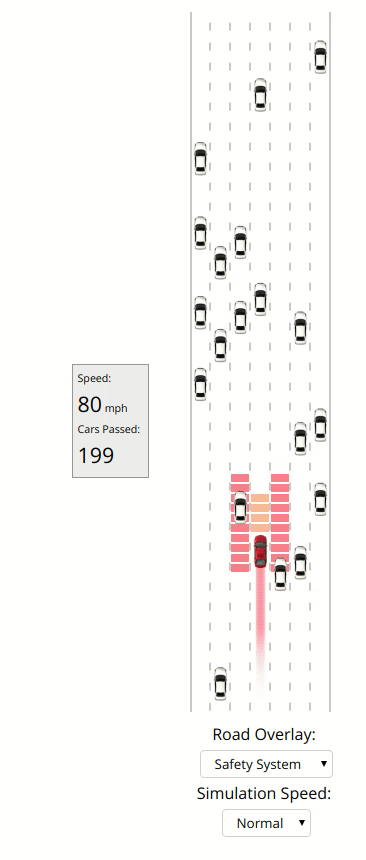
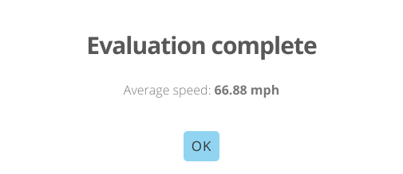

# Deep Traffic

This is a deep reinforcement learning code to avoid traffic in the MIT Deep traffic simulator.

[MIT Simulator](https://selfdrivingcars.mit.edu/deeptraffic//)

## Requirements
    This code runs on javascript and hence it doesn't need any special program to run. All you need is a browser( prefferably chrome).

## Result

This code gives an average speed of a decent ***66.88 mph*** on evaluation.

